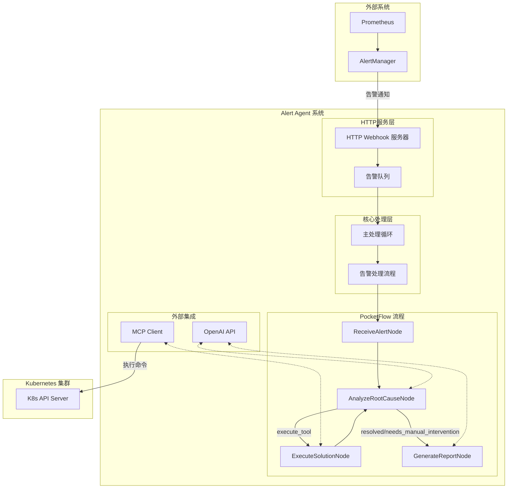

# Alert Agent 项目概述

## 项目简介

Alert Agent 是一个基于 PocketFlow 框架开发的智能告警处理系统，专为 Kubernetes 集群监控设计。该系统能够自动接收、分析和处理来自 Prometheus AlertManager 的告警信息，通过 LLM（大型语言模型）进行智能决策，并能够自动执行相应的 Kubernetes 操作来解决问题或生成详细的报告。

## 核心功能

1. **自动接收告警**：通过 HTTP Webhook 服务器接收来自 Prometheus AlertManager 的告警信息
2. **智能分析根因**：利用 LLM 分析告警信息，确定问题的根本原因
3. **自动执行修复**：根据分析结果，自动执行相应的 Kubernetes 命令进行修复
4. **生成详细报告**：对于已解决的问题或需要人工干预的情况，生成专业的处理报告
5. **异步处理流程**：使用 asyncio 实现异步处理，提高系统效率

## 解决的问题与价值

### 解决的核心问题

1. **告警处理效率低下**：传统的 Kubernetes 告警处理依赖运维人员手动分析和处理，耗时且容易出错。Alert Agent 通过自动化流程大幅提高处理效率。

2. **专业知识壁垒**：Kubernetes 问题诊断需要深厚的专业知识，Alert Agent 将专家经验通过 LLM 模型固化，降低了技术门槛。

3. **重复性工作负担**：运维人员需要处理大量重复性的告警问题，Alert Agent 可以自动处理这些常见问题，让运维人员专注于更有价值的工作。

4. **响应时间过长**：传统告警处理流程从发现问题到解决问题可能需要数小时，而 Alert Agent 可以在秒级或分钟级完成处理。

5. **缺乏标准化处理流程**：不同运维人员处理同类问题的方式可能不同，Alert Agent 提供了标准化的处理流程和报告。

### 带来的价值与效益

1. **运维效率提升**：
   - 自动化处理常见告警，减少 60-80% 的人工干预
   - 将告警响应时间从小时级缩短到分钟级
   - 标准化的处理流程和报告，提高团队协作效率

2. **系统可靠性提升**：
   - 快速响应和修复问题，减少系统宕机时间
   - 主动发现和解决潜在问题，预防重大故障
   - 持续学习和优化，不断提高处理能力

3. **成本节约**：
   - 减少运维人员处理告警的时间，降低人力成本
   - 减少系统宕机带来的业务损失
   - 优化资源使用，降低基础设施成本

4. **知识积累与传承**：
   - 将专家经验固化到系统中，形成知识库
   - 新人可以通过查看处理报告学习问题解决方法
   - 持续积累和优化处理策略

## 技术架构

### 架构图



### 框架与依赖

- **PocketFlow**：核心流程编排框架，用于定义和执行告警处理流程
- **OpenAI API**：用于调用 LLM 进行智能分析和决策
- **MCP Client**：用于执行 Kubernetes 工具和命令
- **HTTP Server**：用于接收 Webhook 告警
- **AsyncIO**：用于异步处理告警队列

### 系统组件

#### 1. HTTP Webhook 服务器

`utils/http_server.py` 实现了一个简单的 HTTP 服务器，用于接收来自 Prometheus AlertManager 的告警信息。当接收到告警时，服务器会将告警数据放入队列中，等待处理。

#### 2. 告警处理流程

`flow.py` 定义了整个告警处理的流程，使用 PocketFlow 框架进行编排。流程包括以下节点：

- **ReceiveAlertNode**：接收告警信息
- **AnalyzeRootCauseNode**：分析告警根因并决定下一步操作
- **ExecuteSolutionNode**：执行 Kubernetes 工具进行修复
- **GenerateReportNode**：生成处理报告

#### 3. 节点实现

`nodes.py` 实现了流程中的各个节点：

- **ReceiveAlertNode**：从共享存储中获取告警数据
- **AnalyzeRootCauseNode**：调用 LLM 分析告警根因，并决定是执行工具、宣布问题已解决，还是需要人工干预
- **ExecuteSolutionNode**：执行 Kubernetes 工具，并将执行结果添加到历史记录中
- **GenerateReportNode**：生成详细的告警处理报告

#### 4. 工具集成

`utils/mcp_client.py` 实现了与 MCP（可能是 Kubernetes 管理平台）的集成，提供了执行 Kubernetes 工具的能力。

#### 5. LLM 调用

`utils/call_llm.py` 封装了对 OpenAI API 的调用，用于智能分析和决策。

## 工作流程

### 一次完整的告警处理流程

1. **接收告警**：
   - Prometheus AlertManager 发送告警到 HTTP Webhook 服务器
   - 告警数据被放入队列中

2. **处理告警**：
   - 主程序从队列中获取告警数据
   - 创建告警处理流程实例
   - 将告警数据放入共享存储

3. **分析根因**：
   - ReceiveAlertNode 处理告警数据
   - AnalyzeRootCauseNode 调用 LLM 分析根因
   - LLM 返回决策结果（执行工具、问题已解决或需要人工干预）

4. **执行修复**（如果决定执行工具）：
   - ExecuteSolutionNode 执行指定的 Kubernetes 工具
   - 执行结果被添加到历史记录中
   - 返回 AnalyzeRootCauseNode 进行下一次决策

5. **生成报告**（如果问题已解决或需要人工干预）：
   - GenerateReportNode 收集告警信息、执行历史等数据
   - 调用 LLM 生成详细的处理报告
   - 报告被存储在共享存储中

## 自动化运维的应用场景

### 常见应用场景

1. **Pod 资源问题处理**：
   - 自动分析和解决 Pod CPU/内存使用率过高的问题
   - 自动扩展 Deployment 的副本数以应对负载增加
   - 自动重启异常状态的 Pod

2. **节点问题处理**：
   - 自动分析节点资源压力并触发节点扩容
   - 自动排查节点网络连接问题
   - 自动处理节点磁盘空间不足的告警

3. **应用健康检查问题**：
   - 自动分析和修复健康检查失败的原因
   - 自动调整不合理的健康检查参数

4. **配置问题处理**：
   - 自动检测和修复配置错误
   - 自动更新过期的证书
   - 自动调整资源配额

### 与现有运维体系的集成

1. **与监控系统集成**：
   - 无缝对接 Prometheus + AlertManager 监控体系
   - 可扩展支持其他监控系统的告警格式

2. **与 CI/CD 流程集成**：
   - 可以将处理报告自动发送到 CI/CD 系统
   - 可以触发自动回滚或更新部署

3. **与工单系统集成**：
   - 对于需要人工干预的问题，自动创建工单
   - 将处理报告附加到工单中，提供详细的问题分析

4. **与通知系统集成**：
   - 可以将处理结果通过邮件、Slack 等渠道通知相关人员
   - 可以根据处理结果的严重程度，选择不同的通知方式

## 系统特点

1. **智能决策**：利用 LLM 进行智能分析和决策，能够处理复杂的告警情况
2. **自动化修复**：能够自动执行 Kubernetes 工具进行修复，减少人工干预
3. **详细报告**：生成专业的处理报告，便于运维人员了解问题和解决过程
4. **异步处理**：使用 asyncio 实现异步处理，提高系统效率
5. **可扩展性**：基于 PocketFlow 框架，可以方便地扩展新的节点和功能

## 部署与配置

### 依赖安装

```bash
pip install -r requirements.txt
```

### 配置文件

`servers_config.json` 配置了 MCP 服务器的信息，用于执行 Kubernetes 工具。

### 环境变量

需要设置 `OPENAI_API_KEY` 环境变量，用于调用 OpenAI API。

### 启动服务

```bash
python main.py
```

启动后，服务器会监听 10000 端口，等待接收告警信息。

## 未来发展方向

1. **更多告警源支持**：扩展支持更多监控系统的告警格式
2. **更丰富的工具集**：增加更多 Kubernetes 工具和操作
3. **自学习能力**：根据处理历史自动优化决策模型
4. **多集群支持**：支持同时管理多个 Kubernetes 集群
5. **Web 界面**：提供可视化的告警处理和报告查看界面

## 总结

Alert Agent 是一个智能的告警处理系统，通过结合 PocketFlow 框架、LLM 和 Kubernetes 工具，实现了告警的自动接收、分析、修复和报告生成。该系统能够大大减少运维人员的工作量，提高告警处理的效率和准确性，降低运维成本，提升系统可靠性。

在云原生和 Kubernetes 日益普及的今天，自动化运维已经成为企业数字化转型的重要一环。Alert Agent 作为一个智能化的自动运维工具，不仅能够解决当前的运维痛点，还能够随着技术的发展不断进化，为企业提供更加高效、可靠的运维服务。